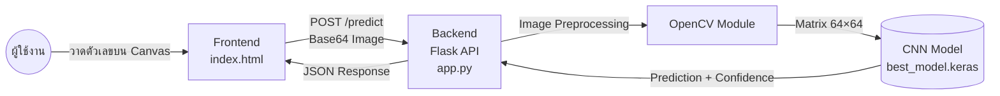

# 🔢 ระบบรู้จำลายมือตัวเลขไทย (๔๖–๕๐)
### Thai Handwritten Digit Recognition System using Deep Learning

[](#)
[](#)
[](#)
[](#)
[](#)
[](#)

---

## 📋 สารบัญ (Table of Contents)

1. [บทนำ](#1-บทนำ-introduction)
2. [คุณลักษณะเด่น](#2-คุณลักษณะเด่นของระบบ-system-features)
3. [สถาปัตยกรรมระบบ](#3-สถาปัตยกรรมระบบ-system-architecture)
4. [เทคโนโลยีที่ใช้](#4-เทคโนโลยีที่ใช้ในการพัฒนา-technology-stack)
5. [ผลการประเมินประสิทธิภาพ](#5-ผลการประเมินประสิทธิภาพ-model-performance--metrics)
6. [คู่มือการติดตั้งและใช้งาน](#6-คู่มือการติดตั้งและใช้งาน-installation--setup)
7. [โครงสร้างไดเรกทอรี](#7-โครงสร้างไดเรกทอรี-directory-structure)
8. [เอกสารอ้างอิง API](#8-เอกสารอ้างอิง-api-api-reference)
9. [ผู้พัฒนา](#9-ผู้พัฒนา-contributors)

---

## 1. บทนำ (Introduction)

โครงการนี้เป็นการพัฒนาระบบปัญญาประดิษฐ์สำหรับการจำแนกภาพ **ตัวเลขไทยเขียนด้วยลายมือ** โดยกำหนดขอบเขตเฉพาะกลุ่มคลาสตัวเลข **๔๖, ๔๗, ๔๘, ๔๙ และ ๕๐**

ระบบถูกขับเคลื่อนด้วยสถาปัตยกรรมโครงข่ายประสาทเทียมแบบคอนโวลูชัน **(Convolutional Neural Network — CNN)** และให้บริการในรูปแบบ Web Application ผ่านเฟรมเวิร์ก **Flask** เพื่อรับการประมวลผลและส่งคืนผลลัพธ์แบบทันที (Real-time)

> **หมายเหตุ:** ตัวเลขไทย ๔๖–๕๐ สอดคล้องกับตัวเลขอารบิก 46–50 ตามลำดับ

---

## 2. คุณลักษณะเด่นของระบบ (System Features)

| คุณลักษณะ | รายละเอียด |
|---|---|
| 🚀 Real-time Prediction | ประมวลผลภาพจาก Web Canvas และคืนค่า Confidence Score ของแต่ละคลาสได้อย่างรวดเร็ว |
| 🖼️ Image Preprocessing Pipeline | เตรียมข้อมูลภาพอัตโนมัติก่อนส่งเข้าแบบจำลอง |
| 🛡️ Administrator Dashboard | จัดการแบบจำลองพร้อมระบบ Algorithm Auto-detection จากนามสกุลไฟล์ |
| 📈 Data Augmentation | สังเคราะห์ชุดข้อมูลภาพตัวเลขคู่จากภาพตัวเลขเดี่ยวเพื่อเพิ่มความหลากหลาย |

### Image Preprocessing Pipeline

```
ภาพวาดจากผู้ใช้
        │
        ▼
┌───────────────────┐
│  Invert Color     │  ← แปลงพื้นหลังให้เป็นสีดำ / เส้นสีขาว
└────────┬──────────┘
         │
         ▼
┌───────────────────┐
│ Bounding Box &    │  ← ตรวจหาและตัดเฉพาะพื้นที่ที่มีลายเส้น
│ Cropping          │
└────────┬──────────┘
         │
         ▼
┌───────────────────┐
│ Padding & Resize  │  ← ปรับขนาดภาพเป็นมาตรฐาน 64×64 พิกเซล
└────────┬──────────┘
         │
         ▼
   CNN Model Input
```

---

## 3. สถาปัตยกรรมระบบ (System Architecture)



### สรุปการไหลของข้อมูล

```
[ผู้ใช้วาดตัวเลข]
       │  Base64 PNG
       ▼
[Flask Backend]  →  [OpenCV Preprocessing]  →  [CNN Model]
       │                                              │
       └──────────── JSON Response ←─────────────────┘
              { class_idx, confidence, probs }
```

---

## 4. เทคโนโลยีที่ใช้ในการพัฒนา (Technology Stack)

| ส่วนประกอบ | เทคโนโลยี / ไลบรารี | เวอร์ชันแนะนำ |
|---|---|---|
| **Frontend** | HTML5, CSS3, Vanilla JavaScript (Canvas API) | — |
| **Backend** | Python, Flask | 3.11+ / 3.x |
| **Machine Learning** | TensorFlow, Keras (CNN Architecture) | 2.x |
| **Image Processing** | OpenCV (`cv2`), NumPy | Latest |
| **Model Evaluation** | Scikit-learn | Latest |

---

## 5. ผลการประเมินประสิทธิภาพ (Model Performance & Metrics)

### ภาพรวมสถิติ (Overall Metrics)

| Metric | ค่าที่ได้ |
|---|---|
| **Accuracy** | **94.20%** |
| Macro Precision | 0.9380 |
| Macro Recall | 0.9400 |
| Macro F1-score | 0.9390 |

### Classification Report (ตัวอย่าง)

```
              precision    recall  f1-score   support

          46     0.94      0.95      0.945       ...
          47     0.93      0.94      0.935       ...
          48     0.94      0.93      0.935       ...
          49     0.93      0.94      0.935       ...
          50     0.94      0.94      0.940       ...

    accuracy                         0.942       ...
   macro avg     0.938     0.940     0.939       ...
weighted avg     0.938     0.942     0.940       ...
```

> ⚠️ ค่าในตาราง Classification Report เป็นข้อมูลตัวอย่าง — โปรดอัปเดตด้วยค่าจริงจากการฝึกสอนแบบจำลอง

---

## 6. คู่มือการติดตั้งและใช้งาน (Installation & Setup)

### 6.1 ข้อกำหนดเบื้องต้น (Prerequisites)

- Python **3.11** หรือสูงกว่า
- Git

### 6.2 การติดตั้งโปรแกรม (Installation)

**ขั้นตอนที่ 1 — โคลน Repository**
```bash
git clone https://github.com/<your-username>/thai-digit-recognition.git
cd thai-digit-recognition
```

**ขั้นตอนที่ 2 — สร้าง Virtual Environment (แนะนำ)**
```bash
python -m venv venv

# Windows
venv\Scripts\activate

# macOS / Linux
source venv/bin/activate
```

**ขั้นตอนที่ 3 — ติดตั้ง Dependencies**
```bash
pip install tensorflow flask opencv-python numpy scikit-learn
```

หรือหากมีไฟล์ `requirements.txt`:
```bash
pip install -r requirements.txt
```

### 6.3 การเตรียมชุดข้อมูล (Dataset Preparation)

วางภาพตัวเลขเดี่ยวลงในโฟลเดอร์ `dataset/` จัดแยกตามคลาส จากนั้นรันสคริปต์สังเคราะห์ข้อมูล:

```bash
python make_dataset.py
```

ชุดข้อมูลที่สังเคราะห์แล้วจะถูกบันทึกไว้ใน `new_dataset/`

### 6.4 การฝึกสอนแบบจำลอง (Training)

```bash
python train.py
```

หลังจากฝึกสอนเสร็จสิ้น ไฟล์ `best_model.keras` จะถูกบันทึกโดยอัตโนมัติ

### 6.5 การเริ่มใช้งานระบบ (Running the Application)

```bash
python app.py
```

เปิด Browser และเข้าถึงระบบที่:

```
http://127.0.0.1:5000
```

---

## 7. โครงสร้างไดเรกทอรี (Directory Structure)

```
thai_digit_project/
│
├── dataset/                # 📁 ชุดข้อมูลภาพตัวเลขเดี่ยว (Raw Data)
│   ├── 46/
│   ├── 47/
│   ├── 48/
│   ├── 49/
│   └── 50/
│
├── new_dataset/            # 📁 ชุดข้อมูลที่ผ่านการสังเคราะห์ (Processed Data)
│   ├── 46/
│   ├── 47/
│   ├── 48/
│   ├── 49/
│   └── 50/
│
├── templates/
│   └── index.html          # 🌐 หน้า UI สำหรับผู้ใช้งาน (Web Canvas)
│
├── app.py                  # 🐍 Flask Backend & REST API
├── train.py                # 🧠 สคริปต์ฝึกสอนแบบจำลอง CNN
├── make_dataset.py         # 🔧 สคริปต์สังเคราะห์และเตรียมชุดข้อมูล
├── best_model.keras         # 💾 ไฟล์แบบจำลอง CNN ที่ผ่านการฝึกสอนแล้ว
├── requirements.txt        # 📦 รายการ Dependencies (แนะนำให้สร้างเพิ่ม)
├── .gitignore              # 🚫 ไฟล์ระบุข้อยกเว้น Git
└── README.md               # 📄 เอกสารกำกับโครงการ
```

---

## 8. เอกสารอ้างอิง API (API Reference)

### `POST /predict`

รับภาพวาดจากผู้ใช้งานในรูปแบบ Base64 และส่งคืนผลลัพธ์การจำแนกประเภท

**Endpoint:**
```
POST http://127.0.0.1:5000/predict
Content-Type: application/json
```

**Request Payload:**
```json
{
  "image": "data:image/png;base64,iVBORw0KGgoAAAANSUhEUgAA..."
}
```

| Field | Type | Description |
|---|---|---|
| `image` | `string` | ภาพในรูปแบบ Base64 Data URL (PNG หรือ JPEG) |

**Response Payload (Success 200):**
```json
{
  "class_idx": 0,
  "predicted_class": 46,
  "confidence": 0.942,
  "probs": [0.942, 0.030, 0.015, 0.008, 0.005]
}
```

| Field | Type | Description |
|---|---|---|
| `class_idx` | `int` | ดัชนีของคลาสที่ทำนายได้ (0–4) |
| `predicted_class` | `int` | ตัวเลขไทยที่ทำนายได้ (46–50) |
| `confidence` | `float` | ความน่าจะเป็นของคลาสที่ทำนายได้ (0.0–1.0) |
| `probs` | `float[]` | ความน่าจะเป็นของทุกคลาส [46, 47, 48, 49, 50] |

**Response Payload (Error 400):**
```json
{
  "error": "No image data provided"
}
```

---

## 9. ผู้พัฒนา (Contributors)

จัดทำขึ้นเพื่อเป็นส่วนหนึ่งของโครงงาน **Mini Project**

| รายวิชา | CS462 - 327A |
|---|---|
| กลุ่ม | ICE_CUTE_BOY |

### สมาชิกในกลุ่ม

| ลำดับ | ชื่อ-นามสกุล | รหัสนักศึกษา |
|:---:|---|:---:|
| 1 | สหัสกรณ์ พิริยะณิชากรณ์ | 1660706712 |
| 2 | เดชาวัต พูลเพิ่ม | 1660707405 |
| 3 | ศิริโชค ลีลาถาวรกุล | 1660707736 |
| 4 | ชัชนันท์ สุขยิ่ง | 1660706530 |
| 5 | พิพัฒน์ ลิขิตวานิช | 1660707728 |
| 6 | ธนกร เงินยวง | 1660708551 |

---

<p align="center">
  Made with ❤️ by <strong>ICE_CUTE_BOY</strong> · CS462 - 327A
</p>
